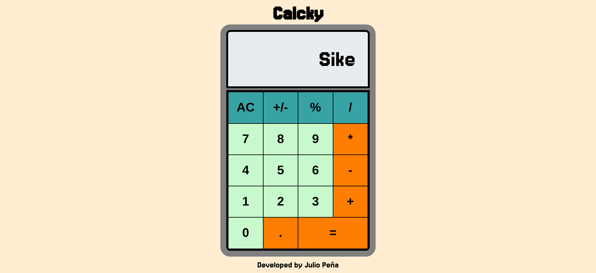

# ➕ Calcky

## Overview
A simple calculator that let's you perform basic arimethic operations 

Live demo: https://julioapv.github.io/calcky/

## 🚀 Project Highlights
- Clean and intuitive calculator interface
- Real-time calculation display
- Error handling for invalid operations

## ✨ Key Features
1. **Basic Operations:**
   - Addition
   - Subtraction
   - Multiplication
   - Division
2. **Additional Functions:**
   - Clear display (AC)
   - Decimal point operations
3. **Display Features:**
   - Real-time input display

## 🎯 Learning Objectives
- Master DOM manipulation for dynamic content updates
- Implement event handling for button interactions
- Practice basic arithmetic logic in JavaScript
- Handle edge cases and error states
- Create responsive layouts using CSS Grid

## 🕹️ How to Use
1. Open the calculator in your browser
2. Input numbers using the number pad
3. Select an operation (+, -, ×, ÷)
4. Press equals (=) to see the result
5. Use clear (AC) to reset

## 🛠️ Technologies Used
- HTML5
- CSS3
- JavaScript (ES6)